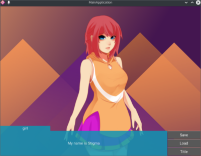

# Stigma Game Demo
This repository contain demo game application based on [Stigma](https://github.com/Kzulfazriawan/stigma) framework. it contain some basic function in game
like save, load, scenario, animation and also option.

# Installation
## windows
1. Download [Python2.7](https://www.python.org/downloads/windows/)
3. Run the installation
4. Run the ***setup.bat*** file, wait until the command prompt closed.
5. Run the ***run.bat***

## Linux
1. Install python through on your terminal.
2. Follow this [Installation instruction](https://kivy.org/docs/installation/installation-linux.html)

# Requirement
- kivy >= 1.9
- cython > 0.21.2
- python >= 2.7
- openGL >= 2.0